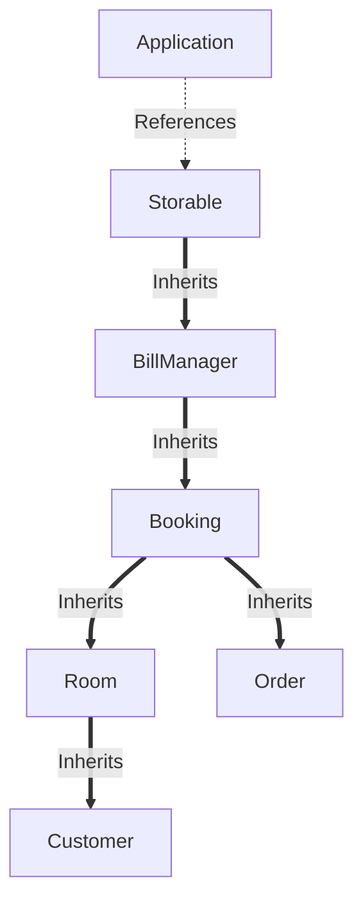

# 🏨 Hotel Management System in C++

## 🔍 Description

This is a comprehensive C++ project designed to simulate the core operations of a hotel management system. It is structured using Object-Oriented Programming principles and split across multiple modular components for maintainability and scalability.

The application provides a command-line interface (CLI) where users can perform key hotel operations like customer entry, room booking, food ordering, and billing — all backed by file-based persistence using serialization and deserialization.

---



## 🚀 Features

### 👥 Customer Management

- Add customer details with ID, contact, and name
- Link customers with room numbers
- Search and verify customers

### 🏠 Room Management

- Initialize 50 rooms with varying services (AC, laundry, food, special)
- Book and pre-book rooms based on preferences
- Mark room availability and booking status
- Display room information on demand

### 🍔 Food Ordering

- 50+ food items with default quantity and pricing
- Item-price management via map and vectors
- Order validation with quantity check
- Bill generation based on selected items

### 💳 Billing System

- Calculate room cost with services, GST, and discount
- Auto-generate order bills and final receipts
- Link bill to room and customer
- Maintain bill history in external files

### 💾 Data Persistence

- Use file I/O to serialize customer, room, and bill data
- Load saved data on app launch via `LoadData` class
- Append-mode writing to preserve past entries

---

## 🗂️ File Organization

```
project/
│
├── main.cpp               # Entry point
├── application.cpp/h      # Controls menu loop and program flow
├── customer.cpp/h         # Handles customer-related operations
├── room.cpp/h             # Room and services logic
├── booking.cpp/h          # Booking and prebooking system
├── order.cpp/h            # Food item management and ordering
├── billManager.cpp/h      # Handles billing logic
├── storable.cpp/h         # Serialization to text files
├── loadData.cpp/h         # Deserialization from text files
├── Makefile               # Build automation script
├── README.md              # Project documentation
├── *.txt                  # Serialized data files
```

---

## 🛠️ Technologies

- **Language:** C++17
- **OOP Concepts:** Inheritance, Encapsulation, Polymorphism
- **Data Storage:** Text file I/O
- **Build System:** Manual or via Makefile
- **IDE/Tools:** Visual Studio Code, g++

---

## 🧪 How to Compile & Run

```bash
mingw32-make       //This will compile all the .cpp files listed under SRC and produce an executable listed on target
./hotel_app.exe //Command to run the executable
```

To clean up build files:

```bash
mingw32-make clean
```

> Ensure all source files are in the same directory as the Makefile.

---

## 📂 Data Files Used

- `customer.txt` – Stores customer details
- `room.txt` – Stores room and booking info
- `order.txt` – Stores order item info
- `bill_Manager.txt` – Stores billing records

---

## 💡 Future Enhancements

- GUI using Qt or SFML
- Switch from flat file to database (SQLite)
- Role-based login for admin/staff
- JSON/CSV export and report generation
- Room availability calendar

---

## 🙌 Author

**Sumit CHAUHAN**  
Student passionate about C++ and real-world problem solving.  
Project developed as a major academic submission to demonstrate system design, OOP principles, and file handling in C++.

---
